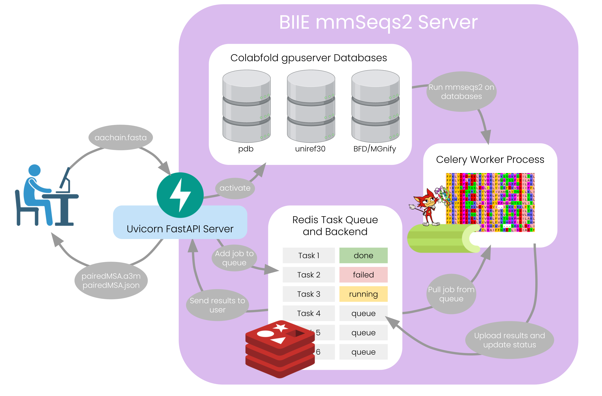

# BIIE MSA Server

A simple Python client for submitting MSA jobs to the [BIIE ColabFold server](https://github.com/renwicks2000/mmseqs_server/tree/master). This runs exactly the same was as the [ColabFold Server](https://github.com/sokrypton/ColabFold), but as there are less people using it, MSA generation is faster. MSAs are generated with the PDB, Uniref30, and the Colabfolddb, which is a combination of the BFD and MGnify. On average, MSA generation should take between 3 and 4 minutes. This is compared to the ~7 minutes when generated via the ColabFold server, and ~40 minutes when using AlphaFold3 JackHMMER.

---
## Table of Contents
1. [Installation](#installation)
2. [Usage](#usage)
3. [Arguments](#arguments)
4. [How it works](#how-it-works)
5. [Notes](#notes)
6. [Server stack overview](#server-stack-overview)
7. [Troubleshooting](#troubleshooting)
8. [Contact](#contact)


---

## Installation

```bash
pip install git+https://github.com/renwicks2000/biie_msa_server.git
```

> You will still need to provide the x-token manually, as shown in usage.

---

## Usage

```python
from biie_msa_server import generate_msa, set_token
from dotenv import load_dotenv

load_dotenv()
set_token(os.getenv("MSA_SERVER_PW")) # to get the password to access the server, please contact sean.renwick@immune.engineering

generate_msa("example.fasta", "output_dir")
```

This will generate an AF3-compatible `.json` and an MSA `.a3m` for each protein chain in the FASTA file. It will generate a folder in the output_dir with the name of your FASTA file and store all outputs there. We suggest running `generate_msa()` in a for loop over all of your FASTA files. 

As shown above, we suggest saving the password in a local `.env` file in the root folder that isn't pushed to git to preserve security. Format your local `.env` like this:

```bash
MSA_SERVER_PW=Password
```
and make sure the `.env` file is in your `.gitignore`.

For a deeper understanding of the server endpoints, please reference [this documentation](http://172.184.108.178:8000/docs#/) (this is only accessible when the server is running).

### Arguments

| Argument      | Type        | Description                           |
|---------------|-------------|---------------------------------------|
| input_fasta   | str or Path | Path to your FASTA input file         |
| output_dir    | str or Path | Directory to store the MSA result     |

---

## How It Works



1. **GPU Server Check**: Before submitting your job, the client checks if the required `mmseqs gpuserver` processes are running on the server.
   - If not running, it will automatically start them via the FastAPI.

2. **FASTA Submission**: Your `.fasta` file is uploaded via a secure POST request to the server.

3. **Task Queue**: The server adds your job to a background **Redis** task queue to avoid overloading the machine.

4. **ColabFold Execution**: Once dequeued, a **Celery Worker** runs ColabFold on your sequence using the AF3-compatible pairing strategy.

5. **Download & Unzip**: Once complete, the client downloads the result `.zip` file and unpacks it into your specified `output_dir`. These outputs will still be accessible later with the same task-id.

6. **Redundancy Handling**: If an `.a3m` or `.json` file already exists in the expected output directory, the job is skipped to avoid recomputation.


---

## Notes

- Please make sure the Azure VM ("cpuonlyvm") hosting the server is running.
- On startup, the VM should automatically start these three servers:
  - Redis
  - Celery worker
  - FastAPI (Uvicorn)
- The first MSA may take longer to generate due to GPU warm-up and database caching.
- If the `gpuserver` database processes are **not running**, the client will start them automatically.
- If MSA generation fails, the client will terminate and restart the gpuservers before resubmitting the job, after which the job fails. 
- Currently, inputs and outputs are stored on the server and are not erased. Once throughput increases this needs to be changed, but for the time being this is not a problem and allows you to access outputs after your run is complete.

---

## Server Stack Overview

This client talks to a server running:

- **FastAPI** (REST interface)
- **Celery** (task queue for job handling)
- **Redis** (Celery broker/backend)
- **ColabFold** (run on GPU with AF3-compatible flags)
- **Systemd** services on the VM for Redis, Celery, and Uvicorn

This setup enables:

- Multi-user safe submissions
- Centralized GPU resource management
- Recovery from GPU stalls or stale processes

For a detailed overview, refer to [How it works](#how-it-works).

---

## Troubleshooting

### gpuserver failed to start

This usually happens if the VM failed to mount the database directory on boot. This should ideally be done automatically, but may fail.

Fix with:

```bash
sudo mkdir /data/databases
sudo mount -a
```

If this does not work, restart the VM.

### "Zero error" or silent MSA failures

After ~60 jobs, the GPU cache or gpuserver state may corrupt. The reason for this is still not 100% clear.

This problem has already been solved partially. If there is a failure, the client automatically restarts the gpuservers, which should circumvent this failure, but this leads to another MSA generation that takes ~1hr (like the first run upon activating the server). If the auto-refresh doesn't work, you may need to completely restart the Azure VM.

This problem requires a more robust solution in the future.

---

## Contact
For server access or bug reports, please contact [Sean Renwick](mailto:sean.renwick@immune.engineeering).